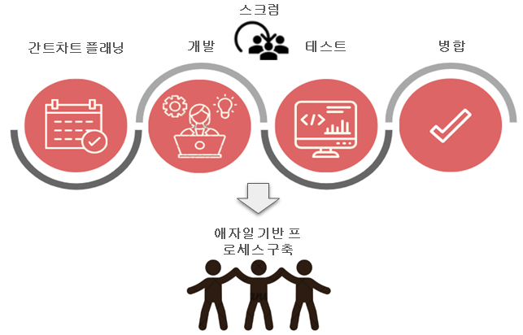
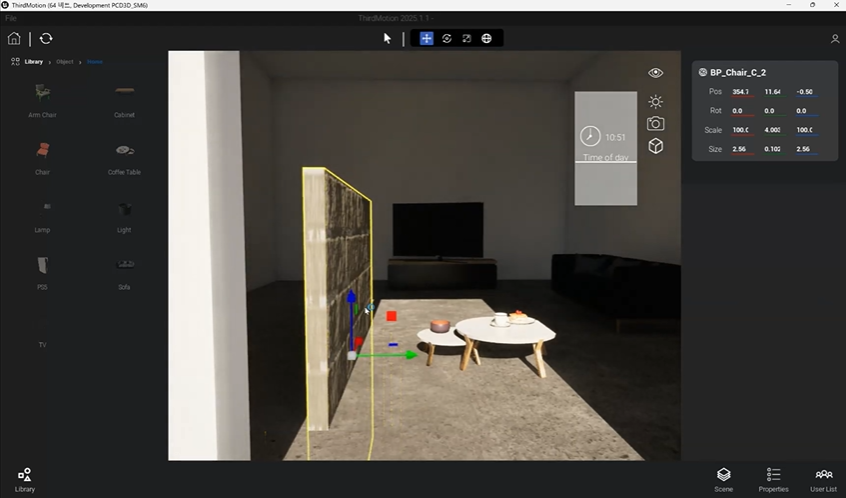
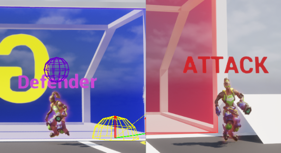

# Portfolio

조은정 포트폴리오 웹사이트입니다.  
Unreal 프로젝트, Server & Database 프로젝트, 이력 및 기술 스택을 한 곳에서 확인할 수 있도록 구성한 포트폴리오입니다.

> "문제의 본질을 파악하고 끝까지 해결하는 프로그래머 조은정입니다."

## Live

- Main Portfolio: https://jjonjung.github.io/Portfolio/vcard/

## Project

<table>
  <tr>
    <td width="50%" valign="top">
      
      <h3>🌆 CitRush</h3>
      
<strong>전략형 레이싱 게임</strong> UE 5.6.1 / C++ / GAS / Steam

      
<strong>Key Achievement</strong>: 불필요한 연산을 최적화하여 <strong>CPU 사용률 약 40% 절감</strong>

      
<strong>Technical Focus</strong>: AI LLM 사용 서버 동기화, GAS, 서버 장애 대응 로직, JIRA 자동화 API 구현

      
<strong>Keywords</strong>: <code>C++</code> <code>Network Replication</code> <code>Optimization</code> <code>Http API</code>

      
Git: <a href="https://github.com/jjonjung/CitRush">https://github.com/jjonjung/CitRush</a>

    </td>
    <td width="50%" valign="top">
      
      <h3>🏹 Infinity</h3>
      
<strong>전략 레이싱 슈팅</strong> UE 5.6.1 / FSM / C++ / Android / 물리 기반 전투 스킬 구현

      
<strong>Key Achievement</strong>: FSM을 활용한 확장성 있는 물리 기반 스킬 시스템 구축

      
<strong>Technical Focus</strong>: 컴포넌트 기반 아키텍처, Android 연동

      
<strong>Keywords</strong>: <code>GAS</code> <code>Steam OSS</code> <code>Component-based</code> <code>Strategy</code>

    </td>
  </tr>
  <tr>
    <td width="50%" valign="top">
      
      <h3>🎨 ThirdMotion</h3>
      
<strong>Unreal 3D 에디팅 툴</strong> UE / C++ / UMG / MVC / TOOL

      
<strong>Key Achievement</strong>: 실시간 협업을 위한 <strong>Listen Server Actor 동기화</strong> 구현

      
<strong>Technical Focus</strong>: 유저 리스트 및 메모 영속화, TwinMotion 모티브 UMG 시스템, 음성/텍스트 동기화, UI

      
<strong>Keywords</strong>: <code>Tool Development</code> <code>Actor Sync</code> <code>Data Persistence</code> <code>UMG</code>

      
Git: <a href="https://github.com/jjonjung/ThirdMotion">https://github.com/jjonjung/ThirdMotion</a>

    </td>
    <td width="50%" valign="top">
      
      <h3>🕺 AiNextIdol</h3>
      
<strong>AI 기반 버추얼 아이돌 공연 플랫폼</strong>

      
<strong>Key Achievement</strong>: AI Agent 연동을 통한 지능형 공연 연출 플랫폼 구현

      
<strong>Technical Focus</strong>: AI 에이전트 인터페이스, 모션 캡처 데이터 연동

      
<strong>Keywords</strong>: <code>AI Integration</code> <code>Virtual Human</code> <code>Motion Capture</code>

      
Git: <a href="https://github.com/jjonjung/AiNextIdol">https://github.com/jjonjung/AiNextIdol</a>

    </td>
  </tr>
  <tr>
    <td width="50%" valign="top">
      
      <h3>⚽ LucioBall</h3>
      
<strong>오버워치 루시우볼 구현</strong> UE / C++

      
<strong>Key Achievement</strong>: 수학적 확률을 적용한 <strong>적 AI 움직임 및 물리 기반 낙하지점 예측</strong> 구현

      
<strong>Technical Focus</strong>: 공격/수비 역할 동적 전환 시스템, 물리 기반 스킬

      
<strong>Keywords</strong>: <code>AI</code> <code>Physics</code> <code>Vector Math</code> <code>Predictive Logic</code>

      
Git: <a href="https://github.com/jjonjung/LucioBall">https://github.com/jjonjung/LucioBall</a>

    </td>
    <td width="50%" valign="top">
      
      <h3>🐵 BlackWukong</h3>
      
<strong>검은신화: 오공 호선봉 전투 구현</strong> UE / Blueprint

      
<strong>Key Achievement</strong>: 캐릭터 액션 시스템, 카메라 시퀀스 구현

      
<strong>Technical Focus</strong>: 상태 머신(FSM) 기반 행동 트리, 정교한 입력 처리

      
<strong>Keywords</strong>: <code>Blueprint</code> <code>Action RPG</code> <code>FSM</code> <code>Combat System</code>

      
Git: <a href="https://github.com/jjonjung/BlackWukong">https://github.com/jjonjung/BlackWukong</a>

    </td>
  </tr>
</table>

---

## 🛠 Technical Stacks

| Category | Skills |
| :--- | :--- |
| **Engine** | Unreal Engine 5.1 ~ 5.6 |
| **Languages** | C++, C#, Java, PHP, T-SQL |
| **Database** | MSSQL (Procedure/Index Optimization), MariaDB, Oracle |
| **Specialty** | GAS, Network Replication, Server-DB Architecture, MES/SAP Interface |

---

## 📬 Contact & Links
- **GitHub**: [jjonjung](https://github.com/jjonjung)
- **YouTube**: [@eunjunggame](https://www.youtube.com/@eunjunggame)
- **Blog**: [Tistory](https://eun15eun.tistory.com/)
- **Email**: jjonjunggame@gmail.com

## Overview

이 프로젝트는 다음 내용을 중심으로 구성되어 있습니다.

- 소개 및 이력
- 기술 스택 정리
- Unreal 프로젝트 포트폴리오
- Server & Database 프로젝트 포트폴리오
- 개별 프로젝트 상세 페이지 연결

  © 2026 Eunjung Cho. All rights reserved.

